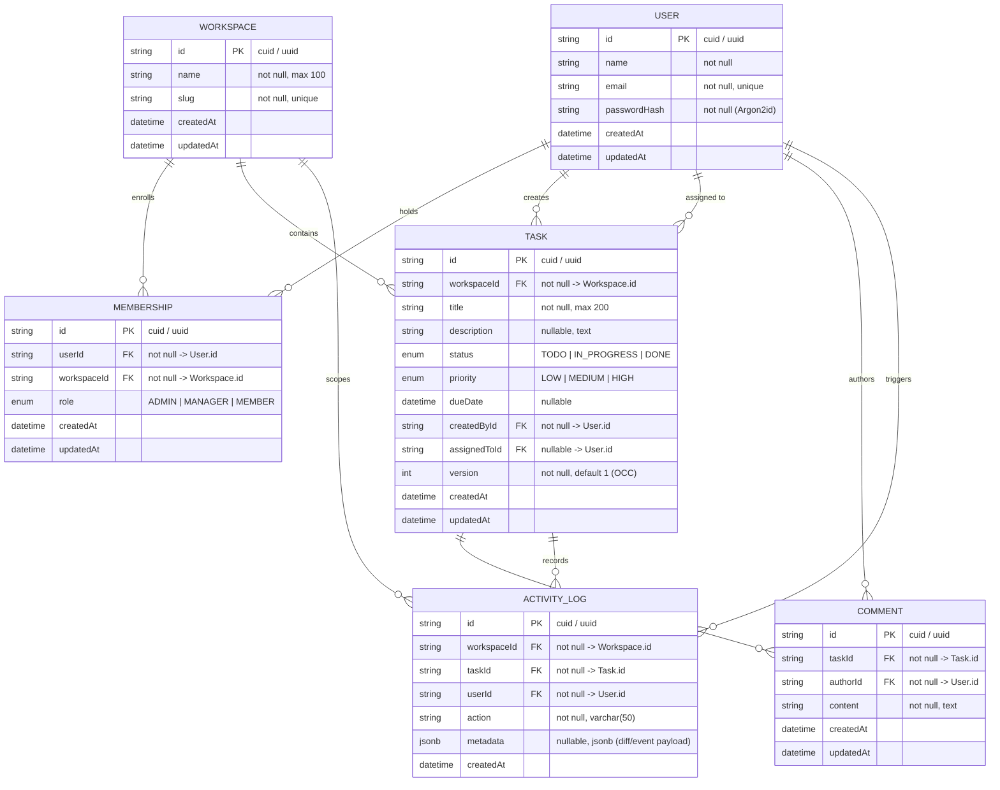

# Database Specification & Normalization Verification — Synchro

## 1. Multi-Tenant Relational Entity-Relationship Diagram

---

## 2. Normalization Verification (Starter.md Section 5)

### First Normal Form (1NF)
- **Atomic Values**: Every relational column contains atomic, indivisible values.
- **Unique Records**: Every entity has a distinct primary key (`id`).
- **No Repeating Groups**: Memberships, tasks, comments, and audit records exist in dedicated relational tables.

### Second Normal Form (2NF)
- Each table uses a single-attribute surrogate primary key (`id`).
- For the composite candidate key in `Membership` (`userId, workspaceId`), `role` depends completely on the combination of who the user is and what workspace they belong to. No partial key dependencies exist.

### Third Normal Form (3NF)
- No transitive dependencies (`X -> Y` where `Y -> non-key`).
- `Task` references `workspaceId`, `createdById`, and `assignedToId`. User details (`name`, `email`) and Workspace details (`name`, `slug`) live exclusively in their respective tables.
- **Notice on User.role**: Having a global `User.role` would violate domain normalization in a multi-workspace system where role varies by organization. Storing `role` exclusively inside `Membership` satisfies 3NF and real-world multi-tenancy.

### Boyce-Codd Normal Form (BCNF)
- In every relation, for every non-trivial functional dependency $X \rightarrow Y$, $X$ is a superkey. Determinants (`id`, unique `(userId, workspaceId)`, unique `email`, unique `slug`) are all candidate keys.

---

## 3. Explicit Architectural Justification for `ActivityLog.metadata` (JSONB)

> [!IMPORTANT]
> **Why JSONB does not violate relational normalization here**:
> In accordance with enterprise architectural principles, `ActivityLog.metadata` is **intentionally stored as PostgreSQL `jsonb`** because it represents variable, non-relational event snapshots (such as state transition diffs `{ "from": "TODO", "to": "IN_PROGRESS" }` or updated field lists).
> - It is **not** used as a relational source of truth.
> - It is **never** queried for foreign relationships or joins.
> - Core relational facts (which user triggered it, which workspace it belongs to, which task it affected, and at what timestamp) are strictly normalized into indexed relational columns (`userId`, `workspaceId`, `taskId`, `createdAt`).

---

## 4. Database Invariants & Integrity Constraints

1. **Unique Membership Constraint**:
   - `@@unique([userId, workspaceId])` ensures a user cannot hold multiple duplicate memberships in the same workspace.
2. **Referential Integrity & Cascades**:
   - `Membership.workspaceId`: `ON DELETE CASCADE` (Deleting a workspace cleans up memberships).
   - `Membership.userId`: `ON DELETE CASCADE` (Removing a user purges their memberships).
   - `Task.workspaceId`: `ON DELETE CASCADE` (Tasks belong strictly to a workspace).
   - `Task.createdById`: `ON DELETE RESTRICT` (A user with active tasks cannot be dropped without reassignment/archival).
   - `Task.assignedToId`: `ON DELETE SET NULL` (Unassigns task if the assigned user is removed).
   - `Comment.taskId`: `ON DELETE CASCADE`.
   - `ActivityLog.taskId`: `ON DELETE CASCADE`.
3. **Concurrency Invariant**:
   - Every `Task` row has a `version` integer starting at `1`. State updates execute `WHERE id = :id AND version = :version` and increment `version` atomically.

---

## 5. Performance Indexing Strategy

| Table | Index Columns | Index Type | Query Justification |
|---|---|---|---|
| `users` | `email` | UNIQUE B-Tree | User lookup, uniqueness verification |
| `workspaces` | `slug` | UNIQUE B-Tree | Workspace lookup by URL slug |
| `memberships` | `(userId, workspaceId)` | UNIQUE B-Tree | User's role resolution in a workspace |
| `memberships` | `workspaceId` | B-Tree | Fetching workspace team directory |
| `tasks` | `(workspaceId, status, priority)` | Composite B-Tree | Workspace dashboard queries & Kanban columns |
| `tasks` | `(workspaceId, assignedToId)` | Composite B-Tree | "My Tasks" query scoped to workspace |
| `tasks` | `(workspaceId, createdAt DESC)` | Composite B-Tree | Timeline pagination within workspace |
| `comments`| `(taskId, createdAt ASC)` | Composite B-Tree | Chronological task discussion feed |
| `activity_logs` | `(workspaceId, createdAt DESC)` | Composite B-Tree | Workspace-wide activity feed |
| `activity_logs` | `(taskId, createdAt DESC)` | Composite B-Tree | Task-specific audit history |
