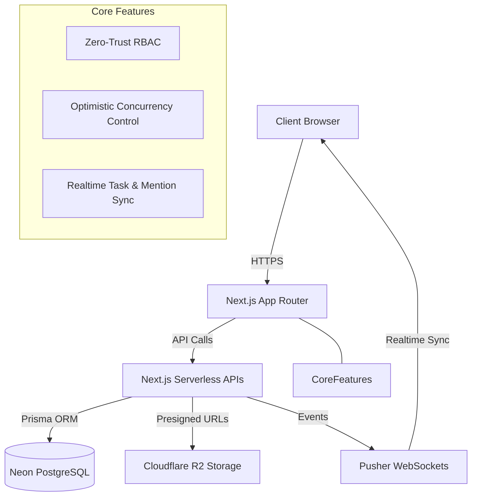

  
  <h1>Synchro - Enterprise Collaborative Task Platform</h1>
  
<strong>An end-to-end Full-Stack SaaS platform that allows teams to orchestrate workflows with precision, security, and realtime concurrency.</strong>

---

## 📝 1. Clear Explanation
**The Problem:** Modern teams need to manage complex projects collaboratively, but existing tools either lack strict enterprise-grade access controls, suffer from "lost updates" when multiple users edit concurrently, or feel bloated and slow.

**The Solution:** A lightweight, highly responsive Jira/Trello alternative offering zero-trust server-side validation, optimistic concurrency control (OCC), and a unified workspace experience.

**Implementation:** Built using Next.js 15 for a lightning-fast React frontend, Prisma + PostgreSQL (Neon) for robust relational data management, and Pusher for sub-second realtime syncing.

**The Result:** A highly secure, visually stunning task management platform where teams can assign tasks, upload secure attachments, and track real-time activity in a seamless environment.

## 🏗️ 2. Architecture Diagram

## 💻 3. Tech Stack
- **Frontend:** React.js, Next.js (App Router), Tailwind CSS, Lucide Icons, cmdk
- **Backend:** Next.js API Routes (Node.js edge/serverless)
- **Database:** PostgreSQL (Neon), Prisma ORM
- **Realtime:** Pusher
- **File Storage:** Cloudflare R2 (S3 API)
- **Language:** TypeScript

## 🔐 4. Security Considerations
- **Cryptographic Hashing:** Custom implementation of Argon2id for state-of-the-art password hashing.
- **Session Protection:** Secure, HttpOnly, SameSite=Lax JWT cookies to prevent XSS exfiltration.
- **IDOR / BOLA Prevention:** Every single database mutation verifies that the user belongs to the associated workspace before executing.
- **Role-Based Access Control (RBAC):** Server-side verification for Admin, Manager, and Member privileges.
- **Secure File Attachments:** Direct-to-R2 presigned upload URLs keep the API server lean while ensuring files are bound to the workspace permissions.

## ⚠️ 5. Error Handling
- **Graceful Degradation:** Beautiful fallback UI components for Not Found, Unauthorized, and Error states.
- **Robust API Responses:** Standardized JSON error payloads (`{ success: false, error: { message: "Reason" } }`) mapped to frontend toast notifications.
- **Optimistic Concurrency Control (OCC):** Prevents "lost updates" by checking task versions before applying writes.

## 🔌 6. Database & APIs
- **Relational Schema:** Highly normalized 3NF Prisma schema ensuring strict referential integrity between Users, Workspaces, Tasks, Dependencies, and Activity Logs.
- **RESTful Endpoints:** Secure POST/GET/PATCH/DELETE endpoints structured hierarchically (e.g. `/api/workspaces/[wsId]/tasks/[taskId]`).
- **Database Indexing:** Composite B-Tree indexes on commonly queried fields (workspaceId, status, priority) for high-performance retrieval.

## 🧪 7. Tests (Implementation Strategy)
- **Unit Testing:** Configured with Vitest for testing pure business logic (RBAC rules, Token Validation).
- **End-to-End (E2E) Testing:** Playwright configured for testing complete user journeys across the authentication pipeline and dashboard rendering.

## 🚀 8. Deployment
- **Optimized for Netlify:** (Frontend & Serverless APIs via Netlify Next.js Runtime).
- **PostgreSQL Hosting:** Neon DB with connection pooling.
- **Object Storage:** Cloudflare R2 globally distributed buckets.
