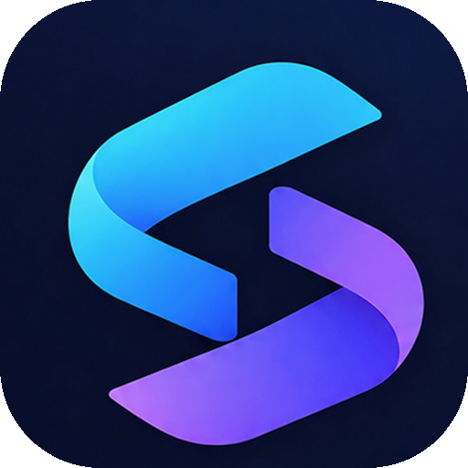

<div align="center">
  
  <h1>Synchro</h1>
  <p><strong>Realtime collaborative workspace and task management system with strict RBAC, built on Next.js and PostgreSQL.</strong></p>
</div>

---

## 🚀 Overview

Synchro is an enterprise-grade task management platform designed to rival Jira and Trello. It brings together realtime collaboration, role-based access control (RBAC), optimistic concurrency control, and secure file attachments in a beautifully designed, high-performance web application.

## ✨ Features

- **Zero-Trust Role-Based Access Control (RBAC):** Server-side verification for Admin, Manager, and Member roles.
- **Realtime Collaboration:** Instant updates across clients for comments, task assignments, and status changes (Powered by Pusher).
- **Optimistic Concurrency Control (OCC):** Prevents "lost updates" when multiple team members edit a task simultaneously.
- **Intelligent Task Tracking:** Automatic overdue detection and priority tagging.
- **Activity Timeline & @Mentions:** Rich audit logs and real-time alerts when you are mentioned.
- **Command Palette:** Keyboard-first navigation via `Ctrl+K` for power users.
- **Secure File Storage:** Direct, presigned uploads to S3/Cloudflare R2 to keep the database lean and secure.
- **Modern Tech Stack:** Next.js App Router, Tailwind CSS, shadcn/ui, Prisma, and PostgreSQL (Neon).

## 🛠 Tech Stack & Architecture

| Layer | Technology | Purpose |
| :--- | :--- | :--- |
| **Frontend & API** | Next.js (App Router), React, Tailwind, Lucide | Full-stack framework & UI |
| **Database** | PostgreSQL (Neon), Prisma ORM | Relational data & modeling |
| **Authentication** | Auth.js (Custom JWT), Argon2id | Identity & Session management |
| **Realtime** | Pusher | WebSocket event delivery |
| **File Storage** | Cloudflare R2 (S3 API) | Secure attachment storage |

## 🚀 Getting Started (Local Development)

### 1. Clone the repository
```bash
git clone https://github.com/yourusername/synchro.git
cd synchro
```

### 2. Install Dependencies
```bash
npm install
```

### 3. Environment Variables
Copy the `.env.example` file to `.env`:
```bash
cp .env.example .env
```
Fill in the required credentials for your **Neon** database, **Pusher** account, and **Cloudflare R2** bucket.

### 4. Database Setup
Push the Prisma schema to your Neon database and seed initial test accounts:
```bash
npx prisma db push
npx tsx prisma/seed.ts
```

*Demo Accounts provided by seed:*
- **Admin:** `admin@test.com` / `Admin123!`
- **Manager:** `manager@test.com` / `Manager123!`

### 5. Start Development Server
```bash
npm run dev
```
Navigate to `http://localhost:3000`.

## 🧪 Testing

Synchro includes extensive testing to guarantee reliability and security:

```bash
# Run unit tests (Vitest) - Covers RBAC, Auth, and utilities
npm run test

# Run E2E tests (Playwright) - Covers user flows and UI
npm run test:e2e
```

## 🔒 Security Posture

- **IDOR Protection:** Every single database mutation verifies that the user belongs to the associated workspace.
- **Password Security:** Hashes are generated using `argon2id`, the industry standard memory-hard algorithm.
- **Session Security:** JWTs are stored in HttpOnly, Secure, SameSite=Lax cookies to prevent XSS exfiltration.

## 📄 License
MIT License
